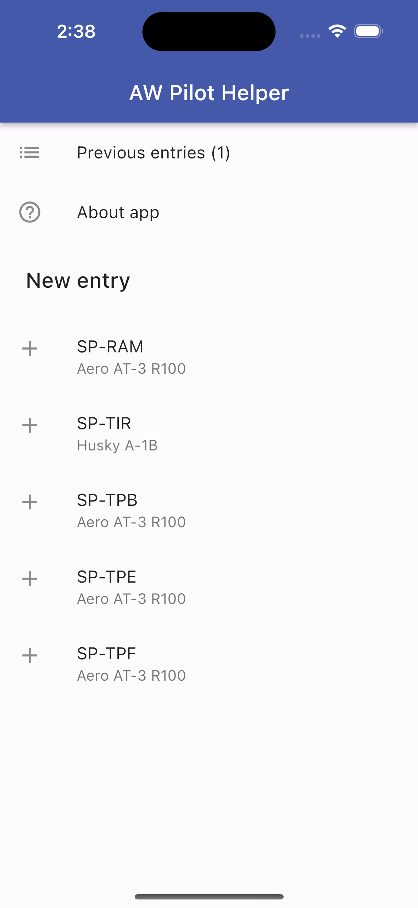

# aw_pilot_helper

| | | |
|-|-|-|
|  |  |  |

## Running app

To run the application you need to provide two dart defines: `API_URL` and `API_TOKEN`. You may run the backend locally as well as use a remote backend.

### VS Code

VS Code launch configuration already provides those defines using your `AW_PILOT_HELPER_API_URL` and `AW_PILOT_HELPER_API_TOKEN` environment variables. Set them accordingly.

## Running backend

Backend uses Strapi. You can run it with `npm run strapi` inside the `strapi/` directory.
